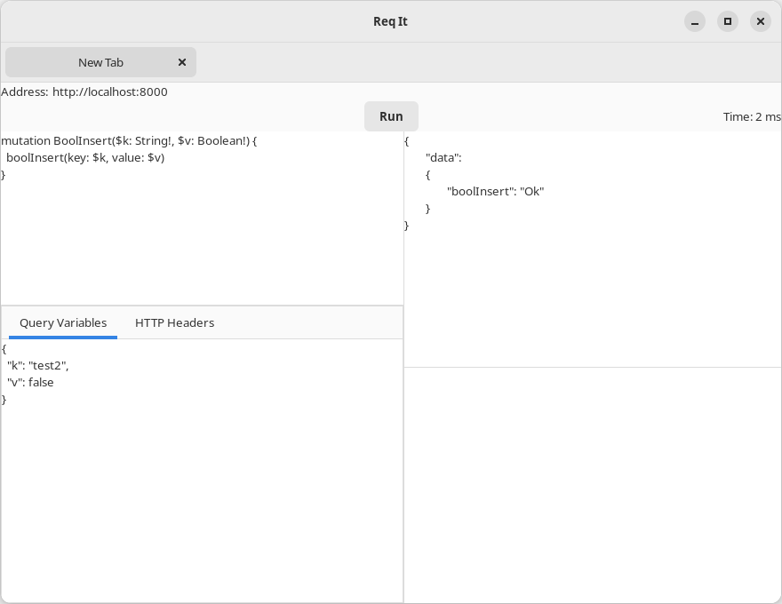

# Req It

Req It is a graphical multi-tab HTTP client for developers.

It currently it only opens a single GraphQL tab when the application starts 

The UI layout is derived from [GraphQL Playground](https://github.com/graphql/graphql-playground). 

 

 

## Build Instructions

See [GTK Estate](https://crates.io/crates/gtk_estate)

The [reqwest](https://crates.io/crates/reqwest) crate requires OpenSSL for building on Linux.

Fedora:

sudo dnf install openssl openssl-devel

 

## Todo:

- Add a menu
- Add functionality to open more tabs.
- Add functionality to open more windows.
- Add a way to save and restore application sessions, tabs and windows.
- Add functionality  to move tabs between windows.
- Complete GraphQL functionality
- Add Tabs for REST requests and other client types.

## Possible:

- Add scripting for Rhai and Lua

